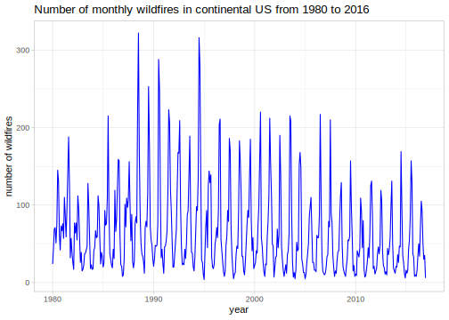
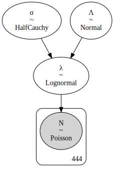
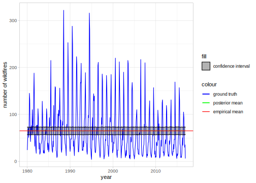
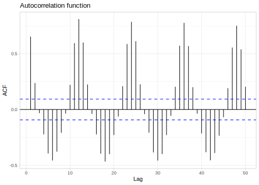
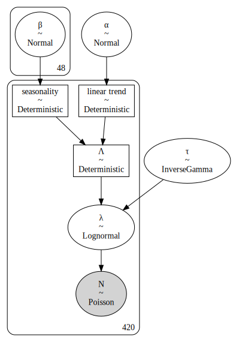
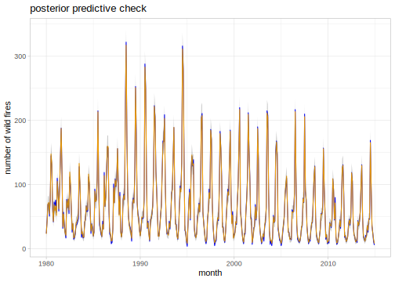
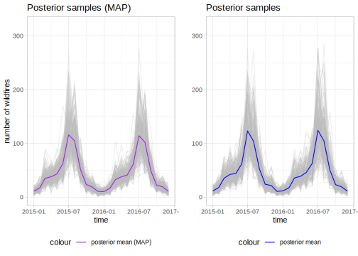

{width="777"}

```{r setup, include=FALSE}
library(tidyverse)
library(lubridate)
library(maps)
library(reticulate)
library(ggridges)
library(knitr)
library(latex2exp)
library(forecast)
library(DT)
ggplot2::theme_set(theme_light())
knitr::opts_chunk$set(
  echo = TRUE, 
  warning = FALSE, 
  message = FALSE, 
  error = FALSE, 
  fig.align = "center"
  )

jet.colors <- colorRampPalette(c("#00007F", "blue", "#007FFF", "cyan", "#7FFF7F", "yellow", "#FF7F00", "red", "#7F0000"))
```

```{python py-setup, include=FALSE}
import numpy as np
import matplotlib.pyplot as plt
import pymc3 as pm
import arviz as az
import theano
from copy import copy

def fourier_series(t, p=365.25, n=10):
    # 2 pi n / p
    x = 2 * np.pi * np.arange(0,n) / p
    # 2 pi n / p * t
    x = x * t[:, None]
    x = np.concatenate((np.cos(x), np.sin(x)), axis=1)
    return x

def det_dot(a, b):
    """
    The theano dot product and NUTS sampler don't work with large matrices?
    
    :param a: (np matrix)
    :param b: (theano vector)
    """
    return (a * b[None, :]).sum(axis=-1)
  
# global variables
N_post_samps = 200
n = 24
P = 12
```

# Introduction

Climate change is a problem that affects us on a global scale. One indicator for climate change are wildfires[\^1](https://www.wwf.de/fileadmin/fm-wwf/Publikationen-PDF/WWF-Study-Forests-Ablaze.pdf). In this analysis we will use a data set hosted by the US' National Incident Feature Service (NIFS) of the [National Wildfire Coordinating Group](https://www.nwcg.gov) (NWCG). that contains among other features the start and end dates of wildfires occurrences from 1980 to 2016.

Our goal is to try and build a model that can predict the number of wild fires in the future, based on the data provided by this data set. For this task we will employ the highly flexibly Log-Normal-Poisson model and extend it to allow for modelling time-dependent modelling.

# Preparing the data

The data set `data/wf_nps_1980_2016.dbf` contains many columns that are not interesting for our objective - in fact, we will only need the starting date (`STARTDATED`) of the wild fires. For visualisation purposes we will additionally keep the longitude (`DLONGITUDE`) and latitude (`DLATITUDE`) of the wildfire.

```{r}
df_raw <- foreign::read.dbf("data/wf_nps_1980_2016.dbf")
df_raw %>% head(n=10)
```

Now we are going to do some pre-processing:

-   We will only consider the continental US, i.e. not Alaska thus we drop all entries with `DLONGITUDE` \> 130

-   Rename the columns to `Year`, `StartDate`, `Longitude`, `Latitude`

-   Drop all columns but `Year`, `StartDate`, `Longitude`, `Latitude`

```{r}
df <-  df_raw %>% 
  select(STARTDATED, DLATITUDE, DLONGITUDE) %>%
  mutate(StartDate = as.POSIXct(STARTDATED, format="%Y-%m-%d"),
         Longitude=DLONGITUDE,
         Latitude = DLATITUDE) %>%
  select(StartDate, Longitude, Latitude) %>%
  filter(Longitude > -130 & Latitude > 20)
```

After these steps our data set looks like this

```{r, echo=FALSE}
df %>%
  arrange(desc(StartDate)) %>%
  head(n=10)
```

Now that we have our data cleaned up we can start visualising it. First we take a look at where the fires occurred. Below is a map showing the cumulative number of wildfires binned into 80 2d bins.

```{r}
US <- map_data("usa") 
ggplot() +
  geom_polygon(data = US, aes(x=long, y = lat), fill="blue", alpha=0.3) + geom_bin2d(data=df, aes(Longitude, Latitude), bins=80) + scale_fill_gradientn(colours = jet.colors(7)) + xlab("Longitude") + ylab("Latitude") + ggtitle("Cumulative number of  wildfires from 1980-2016")
```

Next we are going to group our data by month and sum up all wildfire incidents that occurred within that month. We obtain a time series containing the number of wildfires per month from `r year(min(df$StartDate))` to `r year(max(df$StartDate))`. Each data point corresponds to one month. We can take a look at the data again

```{r, echo=FALSE}
num_fires <- df %>% 
  group_by(month = floor_date(StartDate, "month")) %>% 
  summarise(NFires=n()) 
```

```{r, echo=FALSE}
num_fires %>%
  head(n=10)
```

Plotting the entire data frame reveals the following dynamics of the number of wild fires per month in the US.

```{r, echo=FALSE}
p <- num_fires %>% ggplot(aes(month, NFires)) + geom_line(colour="blue") + ylab("number of wildfires") + xlab("year") + ggtitle("Number of monthly wildfires in continental US from 1980 to 2016")
ggsave("plots/num-wildfires.svg")

```

Now that we have our data cleaned and ready to be analysed we will do just that. But before we can get into actually predicting new future wildfires we first should take some time to understand our model.

# Building the model

The data we are looking at is count data, i.e. *non-negative* and *discrete* data - the number of wild fires in a given month. Our goal is to predict the number of wildfires in the future and for this we need to build a model. Count data in general is modelled by a Poisson distribution which takes a parameter $\Lambda\in (0,\infty]$ (the emission rate) and outputs a *discrete* number on the positive real line $N\in\mathbb N$. The emission rate $\lambda$ controls how many counts are produced on average.

Now in our case we do not know $\Lambda$, in fact $\Lambda$ is precisely what we are trying to infer. As such we will rely on a hierarchical model which we will build up step by step. In a first, very crude approximation we will treat $\Lambda$ as constant. While this obviously does not describe the temporal dynamics displayed by our data set, it can describe the time-averaged data set which we assume is generated by a *homogeneous* Poisson process with emission rate $\overline\Lambda=\langle\Lambda\rangle$.

## The Log-Normal-Poisson Model

A common way to model homogeneous Poisson processes with an unknown (but constant) emission rate $\Lambda$ is the so-called Log-Normal-Poisson model. Since $\Lambda$ is unknown we need a model for $\Lambda$ itself. A reasonable approach would be to model $\Lambda$ as $\Lambda\hookleftarrow\mathcal G(\log\langle N\rangle,\sigma)$, i.e. we assume $\Lambda$ is Gaussian distributed with its mean being the sample mean $\langle N\rangle$ (number of wildfires averaged over time) and some covariance term $\sigma$. One issue with this approach is that the Poisson distribution only allows positive-definite values $\Lambda\in (0,\infty]$ for the emission rate. To fix this we exponentiate $\Lambda$ and introduce a new parameter $\lambda = e^\Lambda$. This parameter is log-normally distributed (because taking the log of $\lambda$ yields $\Lambda$ which is normally / Gaussian distributed). The number of wild fires is then modelled by a Poisson distribution $\mathcal P(\lambda)$ with emission rate $\lambda=e^{\Lambda}$. A schematic representation of this model is given below

```{python}
with pm.Model() as model:
  log_sigma = pm.HalfCauchy("σ", 1.0)
  x = pm.Normal("Λ", np.log(r.num_fires["NFires"].mean()), 10.0)
  lam = pm.Lognormal("λ", x, log_sigma)
  N = pm.Poisson("N", lam, observed = r.num_fires["NFires"])
  trace = pm.sample(1000, chains=1)
```

```{python, echo=FALSE}
with model:
  graph = pm.model_to_graphviz(model=model)
  _ = graph.render("plots/lognormal", format="svg")
  _ = az.plot_trace(trace)
  _ = plt.savefig("plots/lognormal_trace.svg")
```

```{r graph-log-normal, echo=FALSE,fig.cap="schematic representation of the hierarchical model for a homogeneous Poisson process."}

```

Before advancing to a more complex model we can test our model on the data set. Obviously we cannot expect the model to accurately describe our data since it cannot account for the temporal variation in $\lambda$, however both the model and the data set should agree in the temporal mean. One thing to keep in mind is that hierarchical models rarely have analytic solutions. As such we will use the Python packages [PyMC3](https://docs.pymc.io) which allows us to approximate the Bayesian posterior with Markov Chain Monte Carlo (MCMC) sampling.

```{r, fig.align='center', echo=FALSE}
include_graphics('plots/lognormal_trace.svg') 
```

Let's take a second to take a look at the trace plot of our model.

```{python, echo=FALSE}
ppc = pm.sample_posterior_predictive(trace, model=model)
post_mean = ppc["N"].mean(axis=0)
post_std = ppc["N"].std(axis=0)
```

```{r, fig.align='center', echo=FALSE}
p <- data.frame(
  time = num_fires$month,
  NFires = num_fires$NFires,
  post.mean = py$post_mean,
  post.std = py$post_std
) %>% 
  ggplot(aes(time, NFires, colour="ground truth")) + 
  geom_line() + 
  geom_line(aes(y=post.mean, colour = "posterior mean")) + 
  geom_ribbon(aes(ymin = post.mean - post.std, ymax = post.mean + post.std, 
                  fill="confidence interval"), alpha=0.3, colour="black") +
  geom_hline(aes(yintercept=mean(NFires), colour="empirical mean")) + 
  scale_colour_manual(values = c(
    "ground truth" = "blue",
    "posterior mean" = "green",
    "empirical mean" = "red"
  )) + 
  scale_fill_manual(values = c("confidence interval" = "black")) +
  ylab("number of wildfires") +
  xlab("year")

ggsave("plots/log-normal-posterior-mean.svg")

```

## A Dynamic Log-Normal-Poisson Model

In the previous section we built a model for a constant (or averaged) emission parameter $\lambda$. However, a quick look at the data reveals that this parameter is definitely not constant, but rather time-dependent. This means we must model the number of wildfires with an *inhomogeneous Poisson process* with time-dependent emission parameter $\lambda(t)$. Our strategy will be to find a differential equation that describes the time-evolution of the $\lambda$. Once obtained we can use the differential equation to predict future values for $\lambda$ and in turn predict the number of wild fires. One thing that helps us in this task is that the data shows very strong periodicity as can be seen in the autocorrelation function plot below.

```{r, echo=FALSE}
p <- ggAcf(num_fires$NFires, lag.max = 50) + ggtitle("Autocorrelation function")
ggsave("plots/acf.svg")

```

Looking at the autocorrelation function we see that

1.  The data shows constant periodicity, i.e. the period does not change (significantly) over time
2.  The autocorrelation function decays extremely slowly

Combining these two points we can propose the following functional form for $\lambda(t)$

%253D%5Cfrac%7B%5Cbeta_0%7D%7B2%7D+%5Csum%5Climits_%7Bn%253D0%252C2%252C4%252C%5Cdots%7D%5E%7BN%7D%5Cleft%5B%5Cbeta_n%5Ccos%5Cleft(%5Cfrac%7B2%5Cpi%7D%7BP%7Dnt%5Cright)%20+%20%5Cbeta_%7Bn+1%7D%5Csin%5Cleft(%5Cfrac%7B2%5Cpi%7D%7BP%7Dnt%5Cright)%5Cright%5D)

where

-   $\beta_0$ is a global offset

-   $\beta\_{1}\cdots\beta_N$ are the Fourier expansion coefficients.

Further we will account for a linear trend in $\lambda(t)$ of form $\alpha\cdot t$. Thus we arrive at

%253D%5Calpha%5Ccdot%20t%20+%20%5Cfrac%7B%5Cbeta_0%7D%7B2%7D+%5Csum%5Climits_%7Bn%253D0%252C2%252C4%252C%5Cdots%7D%5E%7BN%7D%5Cleft%5B%5Cbeta_n%5Ccos%5Cleft(%5Cfrac%7B2%5Cpi%7D%7BP%7Dnt%5Cright)%20+%20%5Cbeta_%7Bn+1%7D%5Csin%5Cleft(%5Cfrac%7B2%5Cpi%7D%7BP%7Dnt%5Cright)%5Cright%5D)

Finally we put this parameter into a Log-Normal distribution with unknown variance $\tau$ that we assume to be Inverse Gamma distributed. Thus the distribution of the emission parameter $\lambda(t)$ reads

%7C%5Cmu%252C%5Ctau)%253D%5Cfrac%7B1%7D%7B%5Clambda(t)%5Csqrt%7B2%5Cpi%5Ctau%5E2%7D%7D%5Cexp%5Cleft(-%5Cfrac%7B%5Cln(%5Clambda(t)-%5Cmu)%5E2%7D%7B2%5Ctau%5E2%7D%5Cright))

Lastly this $\lambda(t)$ is plugged into a Poisson distribution to yield the final wild fire count.

A graphic representation of this model can be found in below

```{python, warning=FALSE, message=FALSE, error=FALSE}
model = pm.Model()
d = r.num_fires["NFires"][:-24]

with model:
    beta = pm.Normal("β",mu=0, sd=10, shape=2 * n)
    alpha = pm.Normal("α", mu=0, sd=1)
    trend = alpha * theano.shared(np.arange(0, len(d)))
    log_lam = pm.Deterministic("Λ", trend + det_dot(fourier_series(np.arange(len(d)),P,n), beta))
    tau = pm.InverseGamma("τ", alpha=2, beta=1)
    lam = pm.Lognormal("λ", mu=log_lam, sigma=tau, shape=len(d))
    obs = pm.Poisson("N", mu=lam, observed=d)
    trace = pm.sample(1000,chains=1,return_inferencedata=True)
```

```{python, echo=FALSE, warning=FALSE, message=FALSE, error=FALSE}
with model:
    _ = az.plot_trace(trace)
    _ = plt.savefig("plots/dynamic_lognormal_trace.svg")
```

```{r graph-dynamic-log-normal, echo=FALSE}

```

# Predicting future wildfires

For our model we will use $N=$ `r py$n` Fourier frequencies, thus $\boldsymbol{\beta}^{\intercal}$ is a $d=$ `r 2*py$n`-dimensional (one $\sin$ and one $\cos$ function per Fourier mode) vector. As a period we choose $P=$ `r py$P`. This value was chosen because the data displays a yearly periodicity in the autocorrelation function plot.

Now we actually fit our model to the data using Markov Chain Monte Carlo (MCMC) sampling. The trace plot can be found below

```{r trace-dynamic-log-normal, echo=FALSE}
include_graphics("plots/dynamic_lognormal_trace.svg")
```

Looking at the trace plot we see that the Markov Chains and therefore the model has converged nicely. Now we sample from the posterior and see if the posterior mean can reproduce the training data.

```{python, echo=FALSE, warning=FALSE, message=FALSE, error=FALSE}
with model:
    ppc = pm.sample_posterior_predictive(trace)
    post_mean = ppc["N"].mean(axis=0)
    post_std = ppc["N"].std(axis=0)
```

The posterior predictive check is looking good. The posterior is able to reconstruct the input data within it's $1\sigma$ confidence interval.

```{r ppc-dynamic-log-normal, echo=FALSE}
r.ppc <- data.frame(
  t = seq(1,length(py$d)),
  m = py$post_mean,
  S = py$post_std 
)

p <- num_fires %>% 
  slice(c(1:(dim(num_fires)[1]-24))) %>% 
  cbind(r.ppc) %>% 
  ggplot(aes(month)) + 
    geom_line(aes(y=NFires), colour="blue") + 
    geom_line(aes(y=m), colour="orange") + 
    geom_ribbon(aes(ymin=m-S, ymax=m+S),  alpha=0.25) + ylab("number of wild fires") + 
    ggtitle("posterior predictive check")

ggsave("plots/dynamic-log-normal-ppc.svg")

```

```{python, echo=FALSE, warning=FALSE, message=FALSE, error=FALSE}
with model:
  map_estimate = pm.find_MAP()
```

```{python, warning=FALSE, message=FALSE, error=FALSE}
a = trace["posterior"]["α"][0].mean(axis=0).values 
b = trace["posterior"]["β"][0].mean(axis=0).values 
tau = trace["posterior"]["τ"][0].mean(axis=0).values 
lambda_mean = a*np.arange(len(d), len(d) + 24)+det_dot(fourier_series(np.arange(24),12,n), b)
post_samps_mean = np.zeros((N_post_samps, 24))

t = np.arange(24)
for i in range(N_post_samps):
    a = np.random.lognormal(lambda_mean, tau, size=24)
    pred = np.random.poisson(a, size=24)
    post_samps_mean[i, :] = pred

m_mean = post_samps_mean.mean(axis=0)
S_mean = post_samps_mean.std(axis=0)
```

```{python, warning=FALSE, message=FALSE, error=FALSE}
a = map_estimate["α"]
b = map_estimate["β"]
tau = map_estimate["τ"]

lambda_map =  a*np.arange(len(d), len(d) + 24)+det_dot(fourier_series(np.arange(24),12,n), b) 
post_samps_map = np.zeros((N_post_samps, 24))

t = np.arange(24)
for i in range(N_post_samps):
    a = np.random.lognormal(lambda_map, tau, size=24)
    pred = np.random.poisson(a, size=24)
    post_samps_map[i, :] = pred

m_map = post_samps_map.mean(axis=0)
S_map = post_samps_map.std(axis=0)
```

Having checked the model's convergence as well as having performed a posterior predictive check we can finally make a prediction for future wildfires. We fitted the model on all *but* the last 24 data points (the last two years).

Once we have fit the model we need to extract actual values for the parameters $\alpha,\beta,\tau$ from the probability distributions seen in the trace plot. For this there are two common strategies:

1.  Choose the values that maximise the respective probability distributions. This yields the maximum a posteriori (MAP) estimate.

2.  Choose the average (mean) values of the respective Markov chains.

No matter the strategy however we will obtain a set of values $\alpha^{\star},\beta^{\star},\tau^{\star}$ which we will plug into the model alongside the dates of the days for which we want to predict the number of wild fires. This will then yield our posterior prediction.

Given our posterior and our values $\alpha^{\star},\beta^{\star},\tau^{\star}$ we can sample possible realisations of the number of wild fires. We repeat this for `r py$N_post_samps` times and calculate the posterior mean. Below is a plot visualising the `r py$N_post_samps` posterior samples as well as the posterior mean.

```{r posterior-samples, echo=FALSE}
df_pred <- data.frame(
  m_map = py$m_map,
  S_map = py$S_map,
  m_mean = py$m_mean,
  S_mean = py$S_mean,
  ground_truth = num_fires %>% slice((dim(num_fires)[1] - 23): dim(num_fires)[1])
) 

post_df.map <- py$post_samps_map %>% data.frame() %>% data.table::transpose() %>% reshape2::melt()  
post_df.map$time <-rep(df_pred$ground_truth.month)

post_df.mean <- py$post_samps_mean %>% data.frame() %>% data.table::transpose() %>% reshape2::melt()  
post_df.mean$time <-rep(df_pred$ground_truth.month)

p1 <- post_df.map %>% ggplot(aes(time, value)) + geom_line(aes(group=variable), colour="grey", alpha=0.25) + geom_line(data = df_pred, aes(ground_truth.month, m_map, colour="posterior mean (MAP)")) + scale_colour_manual(values = c("posterior mean (MAP)" = "purple")) + ylab("number of wildfires") + ggtitle("Posterior samples (MAP)") + theme(legend.position = "bottom")+ ylim(0,320)


p2 <- post_df.mean %>% ggplot(aes(time, value)) + geom_line(aes(group=variable), colour="grey", alpha=0.25) + geom_line(data = df_pred, aes(ground_truth.month, m_mean, colour="posterior mean")) + scale_colour_manual(values = c("posterior mean" = "blue")) + ylab("") +  ggtitle("Posterior samples") + theme(legend.position = "bottom") + ylim(0,320)

g <- gridExtra::arrangeGrob(p1,p2, nrow=1)
ggsave("plots/posterior-samples.svg", g)

```

In the above plot we see that the posterior produces the sought-after periodicity with the correct period. The MAP and the mean estimate for the model's parameters produce similar results. Given the posterior samples we can calculate the posterior mean as well as the associated uncertainty and compare it to the actual (unseen) data.

```{r}
colors <- c("posterior mean" = "purple", "posterior mean (MAP)" = "magenta", "ground truth" = "black")

p <- df_pred %>%
  ggplot(aes(ground_truth.month)) + 
  geom_ribbon(aes(ymin=m_map-S_map, ymax=m_map+S_map, fill="confidence interval (MAP)"), alpha=0.2) +
  geom_ribbon(aes(ymin=m_mean-S_mean, ymax=m_mean+S_mean, fill="confidence interval"), alpha=0.2) +
  geom_line(aes(y=m_map, colour="posterior mean")) + 
  geom_line(aes(y=ground_truth.NFires, colour="ground truth")) + 
  geom_line(aes(y=m_mean, colour="posterior mean (MAP)")) +
  ylab("number of wildfires") + 
  xlab("time") + 
  ggtitle("Prediction of future wildfires") + 
  scale_color_manual(name = "legend", values = colors) + 
  scale_fill_manual(values = c("confidence interval" = "purple", "confidence interval (MAP)" = "magenta"))

ggsave("plots/dynamic-log-normal-prediction.svg")
include_graphics("plots/dynamic-log-normal-prediction.svg")
```

As we can see our model does a great job at predicting the future. Especially in the year 2015 the posterior mean follows the ground truth very closely. In the second year there are some deviations, especially in July where our model predicted a higher number of wild fires than actually occurred.

# Summary

In the above analysis we developed a Log-Normal-Poisson model capable of representing an inhomogeneous Poisson process with a time-dependent emission rate $\lambda(t)$ that shows periodic behaviour. The model displayed very good performance, especially in the first year of the two year prediction window. This is mostly thanks to the strong periodicity of $\lambda$ which we can very accurately and efficiently model using our proposed Fourier expansion ansatz.

Still this model isn't perfect. Further improvements could be achieved by accounting for linear / quadratic / polynomial trends by adding another trend model to the model for $\lambda$ resulting in a generalised linear model (GLM). Additionally a further analysis of the autocorrelation function could allow us to pre-filter Fourier frequencies, thus allowing us to increase the number of Fourier modes without increasing the computational costs of the model. This would allow us increase the spectral resolution which would allow the model to model small-scale dynamics more accurately. Ultimately the Log-Normal-Poisson model is an extremely versatile model that can be adapted to many other applications outside of wildfire, some of them might appear in future projects of mine.

In the end climate change is an important topics and especially in the recent years many regions were affected by wildfires. As such we should all do our best to keep climate change from making things worse and making the world a little more liveable for humans and animals alike.
