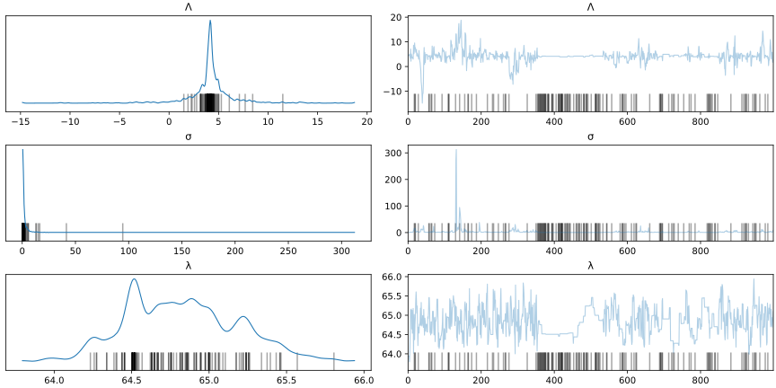

Predicting Continental US Wild Fires
================
Christoph Eberle
9/8/2021


# Introduction

Climate change is a problem that affects us on a global scale. One
indicator for climate change are wildfires[1]. In this analysis we will
use a data set hosted by the US’ National Incident Feature Service
(NIFS) of the [National Wildfire Coordinating
Group](https://www.nwcg.gov) (NWCG). that contains among other features
the start and end dates of wildfires occurrences from 1980 to 2016.

Our goal is to try and build a model that can predict the number of wild
fires in the future, based on the data provided by this data set. For
this task we will employ the highly flexibly Log-Normal-Poisson model
and extend it to allow for modelling time-dependent modelling.

# Preparing the data

The data set `data/wf_nps_1980_2016.dbf` contains many columns that are
not interesting for our objective - in fact, we will only need the
starting date (`STARTDATED`) of the wild fires. For visualisation
purposes we will additionally keep the longitude (`DLONGITUDE`) and
latitude (`DLATITUDE`) of the wildfire.

``` r
df_raw <- foreign::read.dbf("data/wf_nps_1980_2016.dbf")
df_raw %>% head(n=10)
```

    ##    ORGANIZATI UNIT SUBUNIT                               SUBUNIT2 FIREID
    ## 1         NPS AKRO   AKANP Aniakchak National Monument & Preserve 535853
    ## 2         NPS AKRO   AKBLP   Bering Land Bridge National Preserve 270064
    ## 3         NPS AKRO   AKBLP   Bering Land Bridge National Preserve 270065
    ## 4         NPS AKRO   AKBLP   Bering Land Bridge National Preserve 270066
    ## 5         NPS AKRO   AKBLP   Bering Land Bridge National Preserve 270067
    ## 6         NPS AKRO   AKBLP   Bering Land Bridge National Preserve 270068
    ## 7         NPS AKRO   AKBLP   Bering Land Bridge National Preserve 270069
    ## 8         NPS AKRO   AKBLP   Bering Land Bridge National Preserve 270070
    ## 9         NPS AKRO   AKBLP   Bering Land Bridge National Preserve 270071
    ## 10        NPS AKRO   AKBLP   Bering Land Bridge National Preserve 270073
    ##        FIRENAME FIRENUMBER FIRECODE   CAUSE SPECCAUSE STATCAUSE SIZECLASS
    ## 1  Meshik River         75     CL4Z   Human         8         0         F
    ## 2    IMURUK S 5          1     <NA> Natural         1         0         A
    ## 3      GMT W 37          2     <NA> Natural         1         0         C
    ## 4     GMT NW 65          3     <NA> Natural         1         0         B
    ## 5      GMT W 55          1     <NA> Natural         1         0         B
    ## 6     OME NW 65          1     <NA> Natural         1         0         C
    ## 7     OTZ SW 71          1     <NA> Natural         1         0         C
    ## 8      OMENNE84          2     <NA> Natural         1         0         B
    ## 9      OTZ S 60          4     <NA> Natural         1         0         B
    ## 10     EAGLE CK          6     <NA> Natural         1         0         E
    ##    SIZECLASSN FIRETYPE PROTECTION FIREPROTTY YEAR_ FiscalYear STARTDATED
    ## 1           6        1          4         14  2006       2006 2006-05-22
    ## 2           1        2          2         22  1982       1982 1982-06-26
    ## 3           3        1          2         12  1982       1982 1982-06-26
    ## 4           2        2          2         22  1982       1982 1982-06-26
    ## 5           2        2          2         22  1983       1983 1983-07-22
    ## 6           3        1          2         12  1984       1984 1984-06-24
    ## 7           3        1          4         14  1985       1985 1985-08-05
    ## 8           2        1          4         14  1985       1985 1985-08-05
    ## 9           2        1          2         12  1985       1985 1985-08-06
    ## 10          5        1          4         14  1985       1985 1985-08-04
    ##    CONTRDATED   OUTDATED GACC                    DISPATCH  STATE STATE_FIPS
    ## 1  2006-05-28 2006-06-13 AKCC Southwest District Forestry Alaska         02
    ## 2        <NA> 1982-06-26 AKCC Galena Fire Management Zone Alaska         02
    ## 3  1982-06-27 1982-06-28 AKCC Galena Fire Management Zone Alaska         02
    ## 4        <NA> 1982-06-27 AKCC Galena Fire Management Zone Alaska         02
    ## 5        <NA> 1983-07-22 AKCC Galena Fire Management Zone Alaska         02
    ## 6  1984-06-25 1984-06-25 AKCC Galena Fire Management Zone Alaska         02
    ## 7  1985-08-07 1985-08-07 AKCC Galena Fire Management Zone Alaska         02
    ## 8  1985-08-07 1985-08-07 AKCC Galena Fire Management Zone Alaska         02
    ## 9  1985-08-07 1985-08-07 AKCC Galena Fire Management Zone Alaska         02
    ## 10 1985-08-06 1985-08-07 AKCC Galena Fire Management Zone Alaska         02
    ##    FIPS DLATITUDE DLONGITUDE TOTALACRES TRPGENCAUS TRPSPECCAU
    ## 1     2   56.7406  -157.9706     1309.6          2          8
    ## 2     2   65.4993  -163.1693        0.2          1          1
    ## 3     2   65.4037  -162.7807       80.0          1          1
    ## 4     2   65.6793  -163.8210        1.0          1          1
    ## 5     2   65.4787  -163.4124        5.0          1          1
    ## 6     2   65.3893  -163.9682       60.0          1          1
    ## 7     2   65.8510  -163.9216       50.0          1          1
    ## 8     2   65.8493  -164.1027        8.0          1          1
    ## 9     2   65.9424  -163.6408        0.3          1          1
    ## 10    2   65.8826  -163.8860      350.0          1          1
    ##                        Cat_Field DuplicateF   FireName_A Keep Duplicate_
    ## 1  CL4Z/2006/Alaska/MESHIK RIVER       <NA> MESHIK RIVER <NA>          0
    ## 2                           <NA>       <NA>   IMURUK S 5 <NA>          0
    ## 3                           <NA>       <NA>     GMT W 37 <NA>          0
    ## 4                           <NA>       <NA>    GMT NW 65 <NA>          0
    ## 5                           <NA>       <NA>     GMT W 55 <NA>          0
    ## 6                           <NA>       <NA>    OME NW 65 <NA>          0
    ## 7                           <NA>       <NA>    OTZ SW 71 <NA>          0
    ## 8                           <NA>       <NA>     OMENNE84 <NA>          0
    ## 9                           <NA>       <NA>     OTZ S 60 <NA>          0
    ## 10                          <NA>       <NA>     EAGLE CK <NA>          0

Now we are going to do some pre-processing:

-   We will only consider the continental US, i.e. not Alaska thus we
    drop all entries with `DLONGITUDE` > 130

-   Rename the columns to `Year`, `StartDate`, `Longitude`, `Latitude`

-   Drop all columns but `Year`, `StartDate`, `Longitude`, `Latitude`

``` r
df <-  df_raw %>% 
  select(STARTDATED, DLATITUDE, DLONGITUDE) %>%
  mutate(StartDate = as.POSIXct(STARTDATED, format="%Y-%m-%d"),
         Longitude=DLONGITUDE,
         Latitude = DLATITUDE) %>%
  select(StartDate, Longitude, Latitude) %>%
  filter(Longitude > -130)
```

After these steps our data set looks like this

    ##              StartDate  Longitude Latitude
    ## 1  2016-12-31 01:00:00  -83.65436 36.60149
    ## 2  2016-12-29 01:00:00  -84.43994 33.88939
    ## 3  2016-12-28 01:00:00  -92.85920 35.97750
    ## 4  2016-12-28 01:00:00  -78.32153 38.65987
    ## 5  2016-12-15 01:00:00  -73.89689 40.58582
    ## 6  2016-12-09 01:00:00  -93.08161 34.50040
    ## 7  2016-11-29 01:00:00  -73.91767 40.58353
    ## 8  2016-11-28 01:00:00  -80.57455 25.56411
    ## 9  2016-11-28 01:00:00  -83.34310 35.77000
    ## 10 2016-11-27 01:00:00 -101.67420 35.70400

Now that we have cleaned up our data set we are going to group our data
by month and sum up all wildfire incidents that occurred withing that
month. We obtain a time series containing the number of wildfires per
month from 1980 to 2016. Each data point corresponds to one month. We
can take a look at the data again

    ## # A tibble: 10 x 2
    ##    month               NFires
    ##    <dttm>               <int>
    ##  1 1980-01-01 00:00:00     24
    ##  2 1980-02-01 00:00:00     45
    ##  3 1980-03-01 00:00:00     69
    ##  4 1980-04-01 00:00:00     71
    ##  5 1980-05-01 00:00:00     51
    ##  6 1980-06-01 00:00:00     75
    ##  7 1980-07-01 00:00:00    145
    ##  8 1980-08-01 00:00:00    131
    ##  9 1980-09-01 00:00:00     63
    ## 10 1980-10-01 00:00:00     44

Plotting the entire data frame reveals the following dynamics of the
number of wild fires per month in the US.


Now that we have our data cleaned and ready to be analysed we will do
just that. But before we can get into actually predicting new future
wildfires we first should take some time to understand our model.

# Building the model

The data we are looking at is count data, i.e. *non-negative* and
*discrete* data - the number of wild fires in a given month. Our goal is
to predict the number of wildfires in the future and for this we need to
build a model. Count data in general is modelled by a Poisson
distribution which takes a parameter *Λ* ∈ (0, ∞\] (the emission rate)
and outputs a *discrete* number on the positive real line *N* ∈ ℕ. The
emission rate *λ* controls how many counts are produced on average.

Now in our case we do not know *Λ*, in fact *Λ* is precisely what we are
trying to infer. As such we will rely on a hierarchical model which we
will build up step by step. In a first, very crude approximation we will
treat *Λ* as constant. While this obviously does not describe the
temporal dynamics displayed by our data set, it can describe the
time-averaged data set which we assume is generated by a *homogeneous*
Poisson process with emission rate
$\\overline\\Lambda=\\langle\\Lambda\\rangle$.

## The Log-Normal-Poisson Model

A common way to model homogeneous Poisson processes with an unknown (but
constant) emission rate *Λ* is the so-called Log-Normal-Poisson model.
Since *Λ* is unknown we need a model for *Λ* itself. A reasonable
approach would be to model *Λ* as *Λ* ↩ 𝒢(log⟨*N*⟩,*σ*), i.e. we assume
*Λ* is Gaussian distributed with its mean being the sample mean ⟨*N*⟩
(number of wildfires averaged over time) and some covariance term *σ*.
One issue with this approach is that the Poisson distribution only
allows positive-definite values *Λ* ∈ (0, ∞\] for the emission rate. To
fix this we exponentiate *Λ* and introduce a new parameter
*λ* = *e*<sup>*Λ*</sup>. This parameter is log-normally distributed
(because taking the log of *λ* yields *Λ* which is normally / Gaussian
distributed). The number of wild fires is then modelled by a Poisson
distribution 𝒫(*λ*) with emission rate *λ* = *e*<sup>*Λ*</sup>. A
schematic representation of this model is given in
@ref(fig:graph-log-normal)

``` python
with pm.Model() as model:
  log_sigma = pm.HalfCauchy("σ", 1.0)
  x = pm.Normal("Λ", np.log(r.num_fires["NFires"].mean()), 10.0)
  lam = pm.Lognormal("λ", x, log_sigma)
  N = pm.Poisson("N", lam, observed = r.num_fires["NFires"])
  trace = pm.sample(1000, chains=1)
```

    ## █
    ## <string>:6: FutureWarning: In v4.0, pm.sample will return an `arviz.InferenceData` object instead of a `MultiTrace` by default. You can pass return_inferencedata=True or return_inferencedata=False to be safe and silence this warning.
    ## Auto-assigning NUTS sampler...
    ## Initializing NUTS using jitter+adapt_diag...
    ## Sequential sampling (1 chains in 1 job)
    ## NUTS: [λ, Λ, σ]
    ## Sampling 1 chain for 1_000 tune and 1_000 draw iterations (1_000 + 1_000 draws total) took 4 seconds.
    ## There were 83 divergences after tuning. Increase `target_accept` or reparameterize.
    ## Only one chain was sampled, this makes it impossible to run some convergence checks


Before advancing to a more complex model we can test our model on the
data set. Obviously we cannot expect the model to accurately describe
our data since it cannot account for the temporal variation in *λ*,
however both the model and the data set should agree in the temporal
mean. One thing to keep in mind is that hierarchical models rarely have
analytic solutions. As such we will use the Python packages
[PyMC3](https://docs.pymc.io) which allows us to approximate the
Bayesian posterior with Markov Chain Monte Carlo (MCMC) sampling.



Let’s take a second to take a look at the trace plot of our model.

    ## █


## A Dynamic Log-Normal-Poisson Model

In the previous section we built a model for a constant (or averaged)
emission parameter *λ*. However, a quick look at the data reveals that
this parameter is definitely not constant, but rather time-dependent.
This means we must model the number of wildfires with an *inhomogeneous
Poisson process* with time-dependent emission parameter *λ*(*t*). Our
strategy will be to find a differential equation that describes the
time-evolution of the *λ*. Once obtained we can use the differential
equation to predict future values for *λ* and in turn predict the number
of wild fires. One thing that helps us in this task is that the data
shows very strong periodicity as can be seen in the autocorrelation
function plot below.


Looking at the autocorrelation function we see that

1.  The data shows constant periodicity, i.e. the period does not change
    (significantly) over time
2.  The autocorrelation function decays extremely slowly

Combining these two points we can propose the following functional form
for *λ*(*t*)

$$
\\lambda_N(t)=\\frac{\\beta_0}{2}+\\sum\\limits\_{n=0,2,4,\\dots}^{N}\\left\[\\beta_n\\cos\\left(\\frac{2\\pi}{P}nt\\right) + \\beta\_{n+1}\\sin\\left(\\frac{2\\pi}{P}nt\\right)\\right\]
$$

where

-   *β*<sub>0</sub> is a global offset

-   *β*<sub>1</sub>⋯*β*<sub>*N*</sub> are the Fourier expansion
    coefficients.

The inference task now consists of finding the optimal set of parameters
**β**<sup>⊺</sup> = (*β*<sub>0</sub>,*β*<sub>1</sub>,…,*β*<sub>*N*</sub>)<sup>⊺</sup>

``` python
n = 12
P = 12
model = pm.Model()
d = r.num_fires["NFires"][300:-24]

with model:
    beta = pm.Normal("β",mu=0, sd=10, shape=2 * n)
    log_lam = pm.Deterministic("Λ", det_dot(fourier_series(np.arange(len(d)),P,n), beta))
    lam = pm.Lognormal("λ", mu=log_lam, sigma=1.0, shape=len(d))
    obs = pm.Poisson("N", mu=lam, observed=d)
    trace = pm.sample(1000,chains=1,return_inferencedata=True)
```

    ## █
    ## Auto-assigning NUTS sampler...
    ## Initializing NUTS using jitter+adapt_diag...
    ## Sequential sampling (1 chains in 1 job)
    ## NUTS: [λ, β]
    ## Sampling 1 chain for 1_000 tune and 1_000 draw iterations (1_000 + 1_000 draws total) took 58 seconds.
    ## Only one chain was sampled, this makes it impossible to run some convergence checks

    ## array([[<AxesSubplot:title={'center':'β'}>,
    ##         <AxesSubplot:title={'center':'β'}>],
    ##        [<AxesSubplot:title={'center':'Λ'}>,
    ##         <AxesSubplot:title={'center':'Λ'}>],
    ##        [<AxesSubplot:title={'center':'λ'}>,
    ##         <AxesSubplot:title={'center':'λ'}>]], dtype=object)


# Predicting future wildfires

For our model we will use *N* = 12 Fourier frequencies, thus
**β**<sup>⊺</sup> ∈ ℝ<sup>24</sup> is a *d* = 24-dimensional (one sin 
and one cos  function per Fourier mode) vector. As a period we choose
*P* = 12. This value was chosen because the data displays a yearly
periodicity in the autocorrelation function plot. A graphical
representation of the model can be found in
@ref(fig:graph-dynamic-log-normal).

Now we actually fit our model to the data using MCMC sampling. The trace
plot can be found below in @ref(fig:trace-dynamic-log-normal)


Looking at the trace plot we see that the Markov Chains and therefore
the model has converged nicely. Now we sample from the posterior and see
if the posterior mean can reproduce the training data.

    ## █

The posterior predictive check (see @ref(fig:ppc-dynamic-log-normal)) is
looking good. The posterior is able to reconstruct the input data within
it’s 1*σ* confidence interval.


    ## █

``` python
lambda_map = det_dot(fourier_series(np.arange(24),12,n), map_estimate["β"])
N_post_samps = 100
post_samps = np.zeros((N_post_samps, 24))

t = np.arange(24)
for i in range(N_post_samps):
    a = np.random.lognormal(lambda_map, 1.0, size=24)
    pred = np.random.poisson(a, size=24)
    post_samps[i, :] = pred

m = post_samps.mean(axis=0)
S = post_samps.std(axis=0)
```

Having checked the model’s convergence as well as having performed a
posterior predictive check we can finally make a prediction for future
wildfires. We fitted the model on all *but* the last 24 data points (the
last two years). To make a prediction we proceed as follows. First we
use the obtained values for **β**<sup>⊺</sup> from the maximum a
posteriori (MAP) solution to find the values for *λ*(*t*) in the years
2015-2016. Next we plug these values into the log-normal distribution
from which we then draw a sample value *λ*<sup>⋆</sup>. Finally this
value is put into the Poisson distribution and produces a sample for the
number of wildfires at that time *N*<sup>⋆</sup> ↩ 𝒫(*λ*<sup>⋆</sup>).
We repeat this process for 100 times and calculate the posterior mean.
This is seen below.

``` r
colors <- c("posterior mean" = "blue", "ground truth" = "red")

df_pred <- data.frame(
  m = py$m,
  S = py$S,
  ground_truth = num_fires %>% slice((dim(num_fires)[1] - 23): dim(num_fires)[1])
) 

df_pred %>%
  ggplot(aes(ground_truth.month)) + geom_ribbon(aes(ymin=m-S, ymax=m+S, fill="confidence interval"), alpha=0.2) + 
  geom_line(aes(y=m, colour="posterior mean")) + 
  geom_line(aes(y=ground_truth.NFires, colour="ground truth")) + 
  ylab("number of wildfires") + 
  xlab("time") + 
  ggtitle("Prediction of future wildfires") + 
  scale_color_manual(name = "legend", values = colors) + 
  scale_fill_manual(values = c("confidence interval" = "black"))
```


As we can see our model does a great job at predicting the future.
Especially in the year 2015 the posterior mean follows the ground truth
very closely. In the second year there are some deviations, especially
in July where our model predicted a higher number of wild fires than
actually occurred.

# Summary

In the above analysis we developed a Log-Normal-Poisson model capable of
representing an inhomogeneous Poisson process with a time-dependent
emission rate *λ*(*t*) that shows periodic behaviour. The model
displayed very good performance, especially in the first year of the two
year prediction window. This is mostly thanks to the strong periodicity
of *λ* which we can very accurately and efficiently model using our
proposed Fourier expansion ansatz.

Still this model isn’t perfect. Further improvements could be achieved
by accounting for linear / quadratic / polynomial trends by adding
another trend model to the model for *λ* resulting in a generalised
linear model (GLM). Additionally a further analysis of the
autocorrelation function could allow us to pre-filter Fourier
frequencies, thus allowing us to increase the number of Fourier modes
without increasing the computational costs of the model. This would
allow us increase the spectral resolution which would allow the model to
model small-scale dynamics more accurately. Ultimately the
Log-Normal-Poisson model is an extremely versatile model that can be
adapted to many other applications outside of wildfire, some of them
might appear in future projects of mine.

In the end climate change is an important topics and especially in the
recent years many regions were affected by wildfires. As such we should
all do our best to keep climate change from making things worse and
making the world a little more liveable for humans and animals alike.

[1] <https://www.wwf.de/fileadmin/fm-wwf/Publikationen-PDF/WWF-Study-Forests-Ablaze.pdf>
